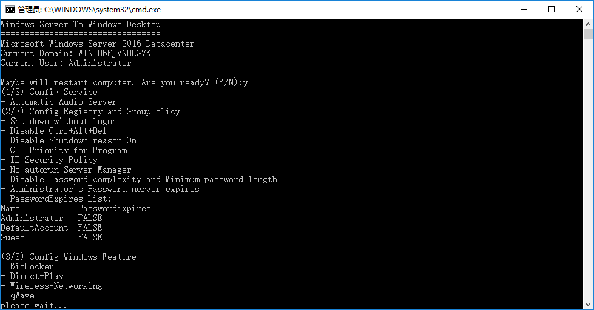

# WindowsServerToWindowsDesktop

A bat script to auto config Windows Server 2016 to "Windows Desktop"

## BAT Will Do:
* Config Service
  - \[Automatic] Windows Audio
  - \[Automatic] Windows Audio Endpoint Builder
  - \[Manual] Windows Remote Management (WS-Management)

* Config Registry and GroupPolicy
  - Enable Shutdown without logon
  - Disable Shutdown reason On
  - ~~No Lock Screen~~
  - Disable Ctrl+Alt+Del login
  - Disable UAC
  - Disable DEP (Turn on DEP for essential Windows programs and services only)
  - Disable SEHOP
  - Enable disk performance counters
  - Enable Video Hardware Acceleration ([Thanks @cjrcl](https://forums.mydigitallife.net/threads/poweshell-script-enabling-gfx-hw-acceleration-in-windows-server-2016.72294/))
  - Enable Audio Hardware Acceleration
  - CPU Priority for Program
  - Adjust Visual Effects (Manual)
  - Adjust IE MaxConnection
  - IE Security Policy
  - Disable TCP Auto-Tuning
  - Change Power Scheme To High Performance
  - No Autorun Server Manager
  - Disable Password complexity and Minimum password length
  - Current user Password never expires
  - Disable Application Experience task schedulers
  - Disable Customer Experience Improvement Program task schedulers

* Config Windows Feature
  - BitLocker
  - Direct-Play
  - Wireless-Networking
  - qWave

## Manual configuration
1. You can close Windows Defender in Windows Settings -> Update and Security - Windows Defender
2. Install Flash player use [install_flash_player_ax.exe](http://fpdownload.macromedia.com/pub/flashplayer/latest/help/install_flash_player_ax.exe) with Windows 7 compatibility mode on file property dialog.
3. Install Graphics drivers and DirectX etc.

## About Docker in Windows Server 2016
Please read [this blog](https://blog.docker.com/2016/09/build-your-first-docker-windows-server-container/).
